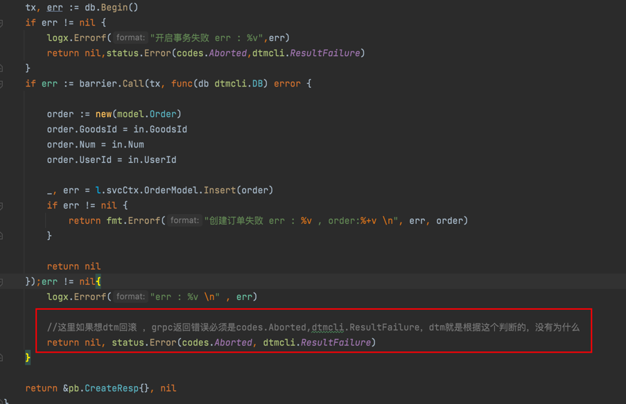

## go-zero对接分布式事务dtm保姆式教程


### 一、首先需要注意

#### go-zero 1.2.4版本以上，这个一定要注意

#### dtm 你用最新的就行了


### 二、clone dtm

```shell
git clone https://github.com/yedf/dtm.git
```


### 三、配置文件

1、找到项目跟文件夹下的conf.sample.yml

2、cp conf.sample.yml   conf.yml

3、使用etcd ， 把配置中下面这段注释打开

```yaml
MicroService:
 Driver: 'dtm-driver-gozero' # name of the driver to handle register/discover
 Target: 'etcd://localhost:2379/dtmservice' # register dtm server to this url
 EndPoint: 'localhost:36790'
```

 解释一下：

MicroService 这个不要动，这个代表要对把dtm注册到那个微服务服务集群里面去，使微服务集群内部服务可以通过grpc直接跟dtm交互

Driver ：'dtm-driver-gozero' ，  使用go-zero的注册服务发现驱动，支持go-zero

Target: 'etcd://localhost:2379/dtmservice'  将当前dtm的server直接注册到微服务所在的etcd集群中，如果go-zero作为微服务使用的话，就可以直接通过etcd拿到dtm的server grpc链接，直接就可以跟dtm server交互了

 EndPoint: 'localhost:36790' ， 代表的是dtm的server的连接地址+端口 ， 集群中的微服务可以直接通过etcd获得此地址跟dtm交互了，

如果你自己去改了dtm源码grpc端口，记得这里要改下端口


### 四、启动dtm server

在dtm项目根目录下

```shell
go run app/main.go -c conf.yml
```


### 五、使用go-zero的grpc对接dtm

项目地址 ：


这里只是做demo，不必纠结于数据库表字段

order-api是http服务入口

order-srv是订单的rprc服务，与dtm-gozero-order数据库中order表交互

stock-srv是库存的rprc服务，与dtm-gozero-stock数据库中stock表交互

整体就是，http调用order-api中立即下单接口，然后order-api立即下单接口会去调用order-srv创建订单并且调用stock-srv扣减库存，因为order-srv与stock-srv是2个独立grpc服务，所以使用dtm来做分布式事务协调


其他不用我多说了，直接看项目地址就可以了


### 六、go-zero对接中注意事项

#### 1、rpc服务的pb路径

在order-api的logic中，调用后端rpc服务时候，找到rpc的pb路径时，一定要找invoke的路径，因为grpc在生成pb文件时候下方也有一堆有路径的，一定要找到invoke那个路径，当然如果你的proto文件方法名字都是大写，这2者都一样如果proto中方法名字小写的，invoke中跟他的方法名就不一样了，如下：

##### proto文件


##### 正确的


##### 错误的


#### 2、dtm的回滚补偿

在使用dtm的grpc时候，当我们使用saga、tcc等如果第一步尝试或者执行失败了，是希望它能执行后面的rollback的，在grpc中的服务如果发生错误了，必须返回 ： status.Error(codes.Aborted, dtmcli.ResultFailure) ， 返回其他错误，不会执行你的rollback操作，dtm会一直重试，如下图：




#### 3、barrier的空补偿、悬挂等

之前准备工作中，我们创建了dtm_barrier库以及执行了barrier.mysql.sql，这个其实就是为我们的业务服务做了一个检查，防止空补偿，具体可以看barrier.Call中源码，没几行代码可以看懂的。

如果我们线上使用的话，你的每个与db交互的服务只要用到了barrier，这个服务使用到的mysql账号，要给他分配barrier库的权限，这个不要忘记了


#### 4、barrier在rpc中本地事务

在rpc的业务中，如果使用了barrier的话，那么在model中与db交互时候必须要用事务，并且一定要跟barrier用同一个事务

logic


model


### 七、使用go-zero的http对接

这个基本没啥难度，grpc会了这个很简单，鉴于go在微服务中去使用http场景不多，这里就不详细去做了，我之前一个版本写过一个简单的，但是没这个完善，有兴趣可以去看下，不过那个barrier是自己基于go-zero的sqlx，将dtm的官方的做了修改，现在不需要了。

项目地址：[https://github.com/Mikaelemmmm/dtmbarrier-go-zero](https://github.com/Mikaelemmmm/dtmbarrier-go-zero)

